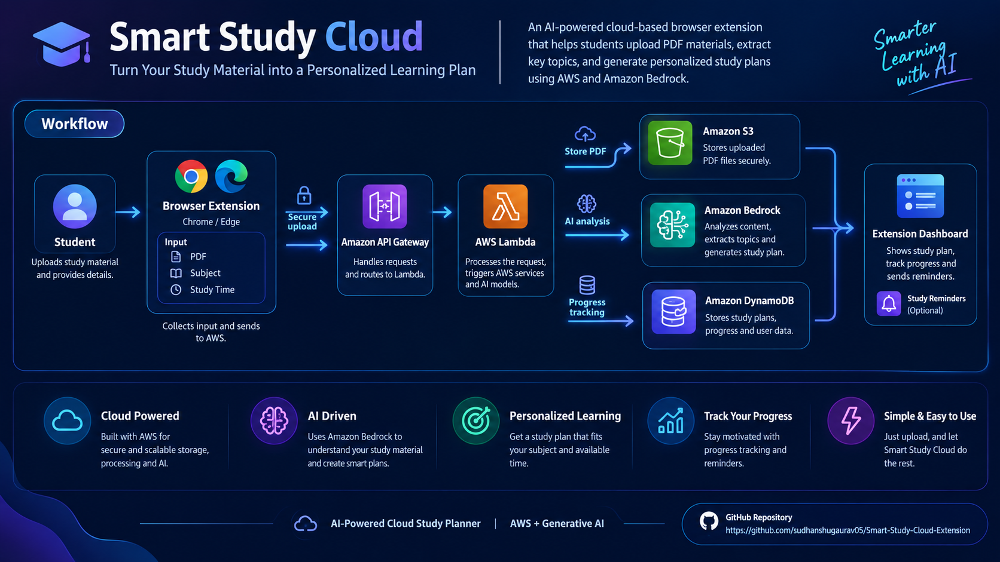

::: {align="center"}
# 🚀 Smart Study Cloud

### AI-Powered Cloud Study Planner for Chrome & Edge

**Turn study material into a personalized learning plan using AWS +
Generative AI.**

[](https://aws.amazon.com/)
[](https://aws.amazon.com/bedrock/)
[](https://developer.chrome.com/docs/extensions/)
[](https://developer.mozilla.org/en-US/docs/Web/JavaScript)
[](https://aws.amazon.com/lambda/)
[](https://aws.amazon.com/dynamodb/)

**[⭐ View
Repository](https://github.com/sudhanshugaurav05/Smart-Study-Cloud-Extension)**
:::

------------------------------------------------------------------------

## ✨ What is Smart Study Cloud?

**Smart Study Cloud** is a cloud-based browser extension designed to
help students organize learning material and build personalized study
plans.

The idea is simple:

> **Upload → Understand → Plan → Track**

A student provides a PDF, subject, and available study time. The
extension sends the request to an AWS backend, where cloud services
handle storage, processing, AI analysis, and study-plan data.

------------------------------------------------------------------------

## 🧠 Core Workflow


GitHub supports Mermaid diagrams directly inside Markdown files, so the
workflow above renders on the repository page.

------------------------------------------------------------------------

## 🖼️ Architecture Overview



------------------------------------------------------------------------

## ☁️ AWS Architecture

  Layer      Technology                Purpose
  ---------- ------------------------- --------------------------------------------
  Browser    Chrome / Edge Extension   Student-facing interface
  API        Amazon API Gateway        Receives HTTPS requests
  Compute    AWS Lambda                Serverless request processing
  Storage    Amazon S3                 Stores uploaded study material
  AI         Amazon Bedrock            Content analysis and study-plan generation
  Database   Amazon DynamoDB           Stores plans and progress
  Frontend   HTML, CSS, JavaScript     Extension UI

------------------------------------------------------------------------

## 🎯 Key Features

-   📄 PDF study-material upload
-   ☁️ Cloud-based document storage
-   🤖 AI-assisted topic extraction
-   🗓️ Personalized study-plan generation
-   ⏱️ Study-time based planning
-   📈 Progress tracking foundation
-   🔔 Reminder-ready architecture
-   🔐 Serverless AWS architecture
-   🌐 Chrome/Edge browser extension
-   📦 Modular architecture for future AI features

------------------------------------------------------------------------

## 🛠️ Tech Stack

### Frontend

-   HTML5
-   CSS3
-   JavaScript
-   Chrome/Edge Manifest V3

### AWS

-   Amazon S3
-   AWS Lambda
-   Amazon API Gateway
-   Amazon DynamoDB
-   Amazon Bedrock

### Development

-   Git
-   GitHub
-   AWS Management Console

------------------------------------------------------------------------

## 📁 Project Structure

``` text
Smart-Study-Cloud-Extension/
│
├── extension/
│   ├── manifest.json
│   ├── popup.html
│   ├── popup.css
│   └── popup.js
│
├── assets/
│   └── smart-study-cloud-workflow.png
│
├── README.md
└── .gitignore
```

------------------------------------------------------------------------

## 🚀 Getting Started

### 1. Clone the repository

``` bash
git clone https://github.com/sudhanshugaurav05/Smart-Study-Cloud-Extension.git
cd Smart-Study-Cloud-Extension
```

### 2. Open Chrome Extensions

Go to:

``` text
chrome://extensions
```

### 3. Enable Developer Mode

Turn on **Developer mode**.

### 4. Load the extension

Choose:

``` text
Load unpacked
```

Then select:

``` text
Smart-Study-Cloud-Extension/extension
```

### 5. Configure the API endpoint

Open:

``` text
extension/popup.js
```

Set your API Gateway endpoint:

``` javascript
const API_URL = "YOUR_API_GATEWAY_URL/upload";
```

Do not commit private credentials, access keys, secret keys, or other
sensitive AWS information to GitHub.

------------------------------------------------------------------------

## 🔄 Request Flow

``` text
Student
   │
   ▼
Chrome / Edge Extension
   │
   │ HTTPS POST
   ▼
Amazon API Gateway
   │
   ▼
AWS Lambda
   │
   ├──────────────► Amazon S3
   │                  │
   │                  └── Study Material
   │
   ├──────────────► Amazon Bedrock
   │                  │
   │                  └── Topics + Study Plan
   │
   └──────────────► DynamoDB
                      │
                      └── Plan + Progress
```

------------------------------------------------------------------------

## 🔐 Security Notes

For learning and prototyping, the project may use broad AWS permissions
during setup.

For production deployment, replace broad permissions with
**least-privilege IAM policies** scoped to:

-   Required S3 bucket/actions
-   Required DynamoDB table/actions
-   Required Bedrock invocation actions
-   Required Lambda execution permissions

Never place AWS access keys or secret credentials inside the browser
extension.

------------------------------------------------------------------------

## 📌 Current Development Status

  Component              Status
  ---------------------- ----------------
  Browser Extension UI   ✅
  PDF Selection          ✅
  S3 Integration         ✅
  Lambda                 ✅
  API Gateway            ✅
  DynamoDB Table         ✅
  Bedrock Integration    🔄 In progress
  AI Study Plan          🔄 In progress
  Progress Dashboard     🔄 Planned
  Automated Reminders    🔄 Planned

> **Note:** Amazon Bedrock availability depends on AWS account/model
> authorization and regional quotas.

------------------------------------------------------------------------

## 🔮 Future Improvements

-   🌐 Analyze the current webpage
-   📝 Generate summaries
-   ❓ AI-generated quizzes
-   📅 Calendar-based study scheduling
-   🔔 Smart daily reminders
-   📊 Learning analytics
-   🎯 Weak-topic detection
-   📚 Multiple subject support
-   🧠 Adaptive study plans

------------------------------------------------------------------------

## 💡 Why I Built This

Students often have plenty of study material but struggle to turn it
into a practical daily plan.

Smart Study Cloud explores how **cloud computing + serverless
architecture + generative AI** can be combined to make that process more
structured and personalized.

------------------------------------------------------------------------

## 👨‍💻 Author

**Sudhanshu Gaurav**

MCA --- Cloud Computing

Interested in:

`Cloud Computing` · `AWS` · `DevOps` · `Generative AI` ·
`Software Development`

------------------------------------------------------------------------

## ⭐ Support

If you find the project interesting, consider giving the repository a
⭐.

**Repository:**\
https://github.com/sudhanshugaurav05/Smart-Study-Cloud-Extension

------------------------------------------------------------------------


### ☁️ Learn Smarter. Plan Better. Build with Cloud.

**AWS + Generative AI + Browser Extension**

